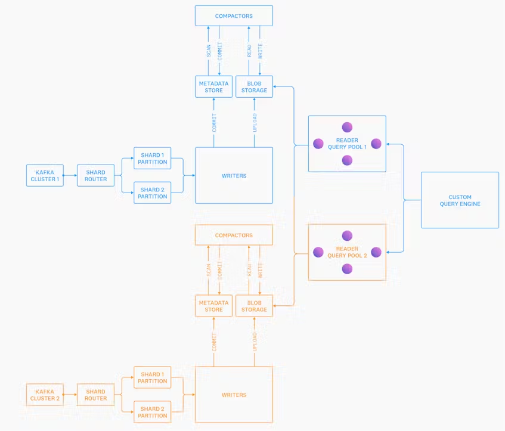

# Introducing Husky, Datadog's Third-Generation Event Store <!-- omit in toc -->

Published: May 17, 2022

https://www.datadoghq.com/blog/engineering/introducing-husky/

**Husky:** DataDog's new internal event storage system

## Table of Contents <!-- omit in toc -->

- [Summary](#summary)
- [Why did they need to build Husky?](#why-did-they-need-to-build-husky)
- [Initial Architecture](#initial-architecture)
- [Decoupled Querying From Clusters \& Added Sharding](#decoupled-querying-from-clusters--added-sharding)
- [Husky](#husky)
- [Husky Performance](#husky-performance)

## Summary

TODO

## Why did they need to build Husky?

What they had before: Metrics

- Stores pre-aggregated timeseries data: `<timeseries_id, timestamp, float64>`

Metrics systems are good for computing timeseries metrics using lots of events because metrics pre-aggregate many events on the web server. For instance, you can pre-aggregate and compress 1 million events that happen in a single second in a single `<timestamp, float64>`.

They also limit their capacity to store context in the form of tags, but there is a tradeoff between unbounded tag cardinality and the time it takes to query for a metric.

- Should tag metrics by long-lived dimensions, such as `datacenter`, `podname`, or `service` and pre-aggregate short-lived dimensions, such as `transaction_id`.

Metrics systems are not suitable for storing log data because a logging system requires:

1. High cardinality data storage
2. High granularity
3. Store all context
4. Must be able to produce arbitrary dimensional aggregates at query time

## Initial Architecture

Had Kafka clusters that were tied to multi-tenant search clusters.

The problem with this approach was that a single misbehaving node could disrupt the experience of all other tenants.

The author does not make it explicitly clear why this happened. It might have been because tenants share the same CPU resources, so particularly expensive queries or huge bursts of Kafka logs from one tenant could clog up the cluster resources and cause other tenants to fail as well.

## Decoupled Querying From Clusters & Added Sharding

- Each node acts as its own "cluster"
  - This means that there won't be cascading failures that were seen in the initial architecture
  - Each node only affects the tenants assigned to that node's shard.
- Created a shard router
  - Tenants are split into an appropriate number of shards based on their own data volume in the past 5 min
  - How does it work?

However, there were several problems that started to appear as the platform grew.

1. A single tenant bursting and emitting a huge number of events would degrade the query performance of other tenants on the same shard.
2. Customers wanted immediately queryable metrics for critical data, but the current architecture doesn't make it cost effective.
3. Customers wanted to be able to query and aggregate on any field in their events without having to specify the indexes in advance
4. Wanted more advanced support for pre-aggregated sketches and re-aggregation at runtime
   1. See: https://www.datadoghq.com/blog/engineering/computing-accurate-percentiles-with-ddsketch/

## Husky

To solve those issues, the team built Husky, a distributed, schemaless, vectorized column store with analytics + search capabilities.

One of the key principles that they adopted from Snowflake and Procella was to **separate compute from storage.**

It sounds complicated, but it basically means that we should decouple each operation of the data pipeline from each other, so that they are not on the same nodes and so that they can individually autoscale.

There are 5 main components:

1. **Writers:** These Kafka writer nodes write data to the metadata store. The benefits of decoupling write nodes from the rest of the system is that now huge bursts of writes no longer impact queries since they are on different nodes!
2. **Compactors:** These scan the metadata store for small files generated by writers and compact them into larger files.
3. **Readers:** These nodes run queries over individual files for partial aggregates in the blob storage. The query engine then reaggregates the results.
4. **Query Engine:** Distributed and decoupled from writers
5. **Metadata Store:** A thin abstraction over FoundationDB that serves as a distributed and serializable store.
   1. They do not explain the metadata store in this blog post in-depth.
6. **Blob Storage:** Stored in S3

## Husky Performance

- Higher median latency, but much lower max latency
